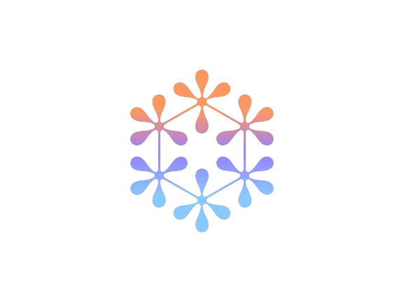

# Suraksha Sanket (*HELP*)
**Safety ki Pukar, Instant Help ki Raahat**
 

## Getting Started

This is a `Flutter` based project.
We have worked to make the `Android` client app.

### Screenshots 
> <table>
  <label>Help v1.0</label>
  <th>
    <td>home</td>
    <td>auth</td>
    <td>splash</td>
    <td>otp</td>
    <td>report</td>
    <td>settings</td>
  </th>
  <tr>
    <td></td>
    <td></td>
    <td></td>
    <td></td>
    <td></td>
    <td></td>
    <td></td>
  </tr>
</table>

<table>
  <label>Suraksha Sanket v1.0</label>
  <th>
    <td>emergency(home)</td>
    <td>settings</td>
    <td>permissions</td>
    <td>report</td>
    
  </th>
  <tr>
    <td></td>
    <td>
      
      </td>
    <td>
      </td>
    <td>
      
    </td>
    <td>
      
    </td>
  </tr>
 
</table>

